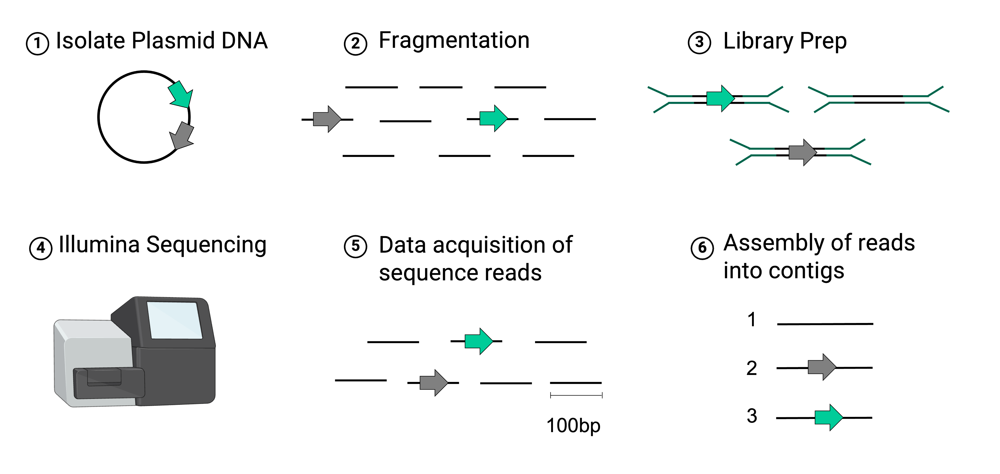

# Co-occurrence analysis of AMR genes

## Quick start

Here is my [code for running a co-occurrence analysis](https://another-goodman.github.io/co-occurrence-analysis/Co-occurrence-analysis-of-AMR-genes.html) with data generated by [abricate](https://github.com/tseemann/abricate). 

1. Screen one or many `.fasta` file(s) against a database with [abricate](https://github.com/tseemann/abricate).
2. [Read the data into R](https://another-goodman.github.io/co-occurrence-analysis/Co-occurrence-analysis-of-AMR-genes.html#reading-in-data).
3. [Wrangle the data](https://another-goodman.github.io/co-occurrence-analysis/Co-occurrence-analysis-of-AMR-genes.html#wrangling-the-abricate-table) by [pre-processing](https://another-goodman.github.io/co-occurrence-analysis/Co-occurrence-analysis-of-AMR-genes.html#pre-processing-the-dataset) and [creating a count table](https://another-goodman.github.io/co-occurrence-analysis/Co-occurrence-analysis-of-AMR-genes.html#creating-a-count-table).
4. Use the [cooccur package](https://griffithdan.github.io/pages/code_and_data/cooccur.html) to [create a cooccur object](https://another-goodman.github.io/co-occurrence-analysis/Co-occurrence-analysis-of-AMR-genes.html#creating-a-cooccur-object) and [visulise it as a heatmap](https://another-goodman.github.io/co-occurrence-analysis/Co-occurrence-analysis-of-AMR-genes.html#plotting-cooccurence-using-pheatmap).

The code is organised in a way code can be used for any table produced by [abricate](https://github.com/tseemann/abricate) to screen against a database of genes. 

## Introduction 

Short read sequencing makes de novo genome assembly difficult at the site of repeated sequences, which cannot be bridged if the reads are shorter than the repeat length. The inability to traverse repetitive regions makes de novo genome assembly difficult at the site of repeated sequences, which cannot be bridged if the reads are shorter than the length of the repeat. 

We used co-occurrence analysis to overcome these limitations of short-read sequencing. Co-occurrence analysis allows for the comparison of genetic interactions across genomes. It can show which genes are carried together hinting at carriage on the same or different replicons. We ran a probabilistic analysis of gene co-occurrence to understand the genetic location of AMR genes relative to each other in short-read genomic data. 

## Methodology

We used SPAdes v3.11.1 to assemble 772 genomes of Escherichia coli and Klebsiella pneumoniae previously sequenced and isolated from blood and stool samples from Blantyre, Malawi. [Abricate](https://github.com/tseemann/abricate) v0.0.9 was used to screen for AMR genes against the Resfinder database (60% minimum length and 90% percentage identity).

We then used the [cooccur package](https://griffithdan.github.io/pages/code_and_data/cooccur.html) v1.3 in R v4.3.1 to employ a probabilistic model to determine whether each pair of genes had an observed co-occurrence which was significantly different from the expected co-occurrence, revealing genetic interactions among AMR genes. If a pair of genes were observed to co-occur significantly less than expected by chance their relationship was termed negative, if they were observed to co-occur significantly more it was termed positive and any pair of genes which were observed to co-occur with no significant difference from their expected value were termed random. A significant difference was defined as having a p-value ≤ 0.05. 

The final figure will look like this:

## How to run a co-occurrence analysis

You will find the complete code including instructions about how to run it [here](https://another-goodman.github.io/co-occurrence-analysis/Co-occurrence-analysis-of-AMR-genes.html).

This analysis takes a binary table of AMR genes present in a defined set of genomes from abricate and creates a co-occurrence matrix and subsequent analysis of the co-occurrence interactions between AMR genes across the genomes. The code can be used for any table produced by [abricate](https://github.com/tseemann/abricate) to screen against a database of genes. 

1. Screen one or many `.fasta` file(s) against a database with [abricate](https://github.com/tseemann/abricate). You can screen against AMR genes (CARD, Resfinder), virulence factors (VFDB) and metal resistance genes (MEGARES).
3. [Read the data into R](https://another-goodman.github.io/co-occurrence-analysis/Co-occurrence-analysis-of-AMR-genes.html#reading-in-data).
4. [Wrangle the data](https://another-goodman.github.io/co-occurrence-analysis/Co-occurrence-analysis-of-AMR-genes.html#wrangling-the-abricate-table) by [pre-processing](https://another-goodman.github.io/co-occurrence-analysis/Co-occurrence-analysis-of-AMR-genes.html#pre-processing-the-dataset) which includes the removal of duplicates and [creating a count table](https://another-goodman.github.io/co-occurrence-analysis/Co-occurrence-analysis-of-AMR-genes.html#creating-a-count-table) which allows us to display it in a way in which we can make it into a co-occurrence table.
5. Use the [cooccur package](https://griffithdan.github.io/pages/code_and_data/cooccur.html) to [create a cooccur object](https://another-goodman.github.io/co-occurrence-analysis/Co-occurrence-analysis-of-AMR-genes.html#creating-a-cooccur-object). This can then be visualised with the [cooccur package itself](https://another-goodman.github.io/co-occurrence-analysis/Co-occurrence-analysis-of-AMR-genes.html#plotting-cooccurence-using-cooccur-function) or as a [heatmap](https://another-goodman.github.io/co-occurrence-analysis/Co-occurrence-analysis-of-AMR-genes.html#plotting-cooccurence-using-pheatmap) with the [pheatmap](https://www.rdocumentation.org/packages/pheatmap/versions/1.0.12/topics/pheatmap) function. You can either visulise the heatmap to contain all the genes in the matrix or [subset](subsetting-from-probability-table-table) to pick a selection of interesting genes.  
